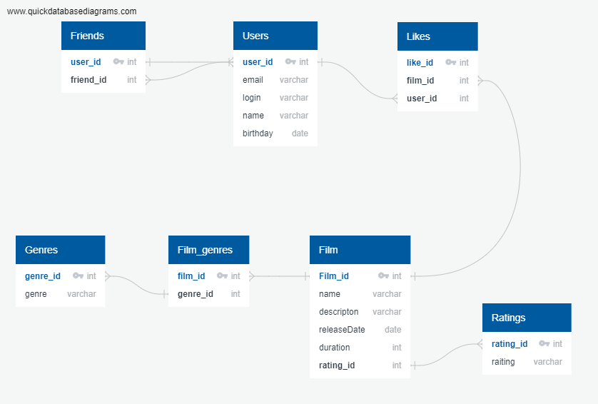

# java-filmorate

## Модель базы данных



#### Пример запросов:

* Получение списка фильмов

```
SELECT *
FROM FILM;
```

* Получение списка пользователей

```
SELECT *
FROM USERS;
```

* Получение фильмов с рейтингом R и сортировкой по продолжительности

```
SELECT *
FROM FILM AS f
INNER JOIN ratings AS r ON r.rating_id = f.rating_id
WHERE r.rating = 'R'
ORDER BY f.duration
```
