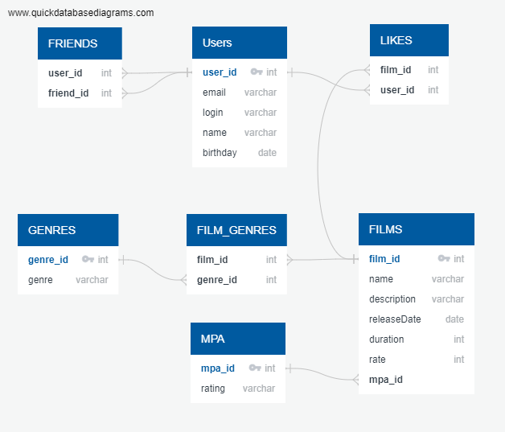

# java-filmorate

## Модель базы данных



#### Пример запросов:

* Получение списка фильмов

```
SELECT *
FROM FILMS;
```

* Получение списка пользователей

```
SELECT *
FROM USERS;
```

* Получение фильмов с рейтингом R и сортировкой по продолжительности

```
SELECT *
FROM FILMS AS f
         INNER JOIN MPA ON MPA.mpa_id = f.mpa_id
WHERE MPA.rating = 'R'
ORDER BY f.duration
```
